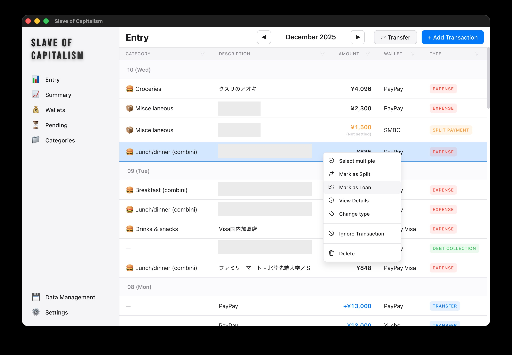
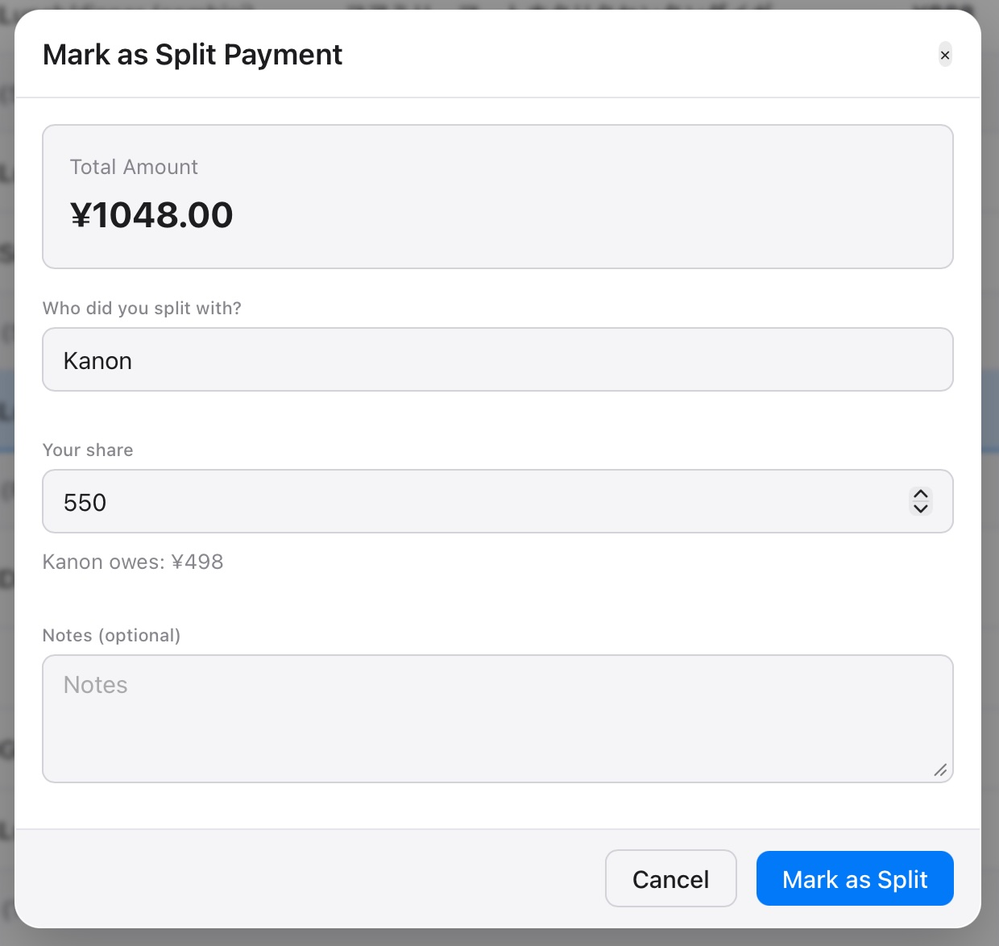

# Slave of Capitalism: a local-first personal finance manager

## Introduction

This app is my personal take on what a modern, automated double-entry bookkeeping system should look like. It contains everything needed to track finances without losing one's sanity.

The motivation behind this project is simple: I used to manage everything in Excel. It was a weekly ritual of opening PayPay (a major e-wallet in Japan), staring at the history, classifying transactions manually, adding (the amount) into a summarization spreadsheet. The worst part was the "mystery gap": that annoying discrepancy between my physical wallet and the Excel balance that forced me to wonder where my money vanished.

This is a desktop application, not a webapp. Everything is stored locally and you don't have to setup anything.

<div>
    
    <p>Main screen of the app, filled with <i>real data</i></p>
</div>

This entire codebase was Vibecoded 100% by Antigravity. This is in the sense that I did not write a single line of code. The AI alone of course created many questionable architectural choices and had to be adjusted gradually only through natural language. Without such a capable agentic workflow, I probably would have given up at the boilerplate stage since I don't know modern front-end development at all. 

Implementing a finance tracker from scratch turns out to be a brilliant way to understand the subtle complexities of debt, shared expenses, and floating money that standard apps gloss over. I definitely had a few "naruhodo" moments while figuring out how to model split payments correctly.

**To be implemented:**

- [ ] Advanced charting and visualization
- [ ] Excel export

## Quick guide

### 1-Click PayPay Import

The killer feature here is the import wizard. Instead of manual entry, we feed it raw CSV exports from PayPay. The system uses a small grammar for rule-based classification.

```
amount > 600, amount < 1000, description *= "ファミリ" -> Combini lunch/dinner
amount > 600, amount < 3000, method = "sent" -> Dining out
time < 11:00, amount < 210 -> Combini coffee
time >= 11:00, amount < 300 -> Drinks & snacks
description *= "アオキ", amount < 5000 -> Market groceries
description *= "ダイソー" -> Supermarket - other
description *= "OPENAI" -> Subscriptions
```

### Split payments

This is where it beats most generic budget tracking app. You can handle shared expenses by specifying exactly how much of a transaction was actually *your* cost. The app tracks the remainder as a receivable. Extremely useful for frequent hangout with friends.

<div>
    
    <p>Creating a split payment</p>
</div>

When your friend pays you back, you right click that repayment transaction and link it to the original expense, settling the balance. This do both things: it keeps your "spendable" balance accurate while remembering that someone still owes you for that dinner 3 weeks ago.

### Consolidation (Merging)

"I went on a trip to Osaka last weekend and made 10 transactions in total".

Select them all, right-click, and **Merge**. They become a single transaction with the total amount. This is crucial for keeping your ledger readable vs. the raw noise from bank imports.

### Wallet calibration

Wallet calibration is for those times when reality drifts from the records. If your wallet says ¥10,000 but the app says ¥5,500, you just tell the app the real number. It creates a "calibration" entry to account for the difference.

Later, if you remember you bought a sneaky snack, you can "resolve" that calibration. The app will create the new transaction for the snack and automatically adjust the calibration amount, keeping the history clean and the balance perfect.

### Other typical features

**Loan and debt**: Sometimes you lend money without an associated expense, or you borrow cash. The system supports tracking these as distinct entities, ensuring your net worth calculation remains accurate even when you're technically "rich" in IOUs.

## Tech stack

This application is built with a modern, high-performance stack:

- **Frontend**: [SvelteKit](https://kit.svelte.dev/) (TypeScript) + [Tauri v2](https://tauri.app/) for a lightweight, native desktop experience.
- **Backend**: [FastAPI](https://fastapi.tiangolo.com/) (Python) for robust API handling and business logic.
    - All financial logic is implemented in this FastAPI layer. The Python application is compiled into a static binary using [PyInstaller](https://pyinstaller.org/) and spawn on a random port (or any configurable port) upon app startup.
- **Database**: [SQLite](https://www.sqlite.org/) for local, self-contained data storage.

## Build for production

Simply run:

```bash
make install
make build
make open # On OSX
```

## Build for development

1. Install the backend dependencies:
```bash
cd backend
poetry install
```

2. Run the backend server:
```bash
poetry run python -m app.main --database /path/to/sqlite.db --port 8000 --host 127.0.0.1
``` 

3. Run the frontend development server:
```bash
cd frontend
npm run tauri dev
```

In development mode, the frontend will always access the backend at `localhost:8000` regardless of the app's settings.

# More screenshots

Coming soon.